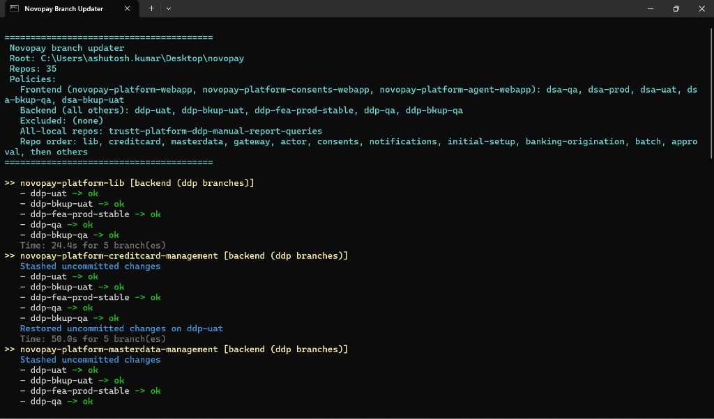

# Novopay Branch Updater

Windows tool to sync `ddp-*` / `dsa-*` git branches across the Novopay multi-repo workspace, with an HTML report, optional idle scheduling, and IntelliJ integration.

## What it does

- Walks every git repo under your novopay folder
- Updates configured branches from `origin` (merge, abort on conflict, continue)
- Auto-stashes uncommitted work, then restores it on your original branch
- Opens an HTML summary in your browser; the report file is removed when you close that tab
- No log files are written

## Recommended workflow (IDE indexing)

For the fastest IntelliJ / WebStorm experience after a sync:

1. **Close the IDE completely** before you run the updater (IntelliJ indexes git roots heavily; closing avoids it fighting branch checkouts across 30+ repos).
2. Run **`run.cmd`** (or the IntelliJ external tool - see below) and wait until the console says `DONE` and the browser report opens.
3. Review the report, then **close the browser tab** (this deletes the HTML file).
4. **Open the IDE again** on the novopay workspace. Indexing runs once against the updated branches instead of competing with git operations mid-run.

Scheduled runs (9 AM / 9 PM) follow the same idea: they only fire when you have been idle, so the IDE is usually already closed.

## Screenshots

### Console while running

Repos are processed in a fixed priority order. Stash / restore messages appear when you have local changes.



### HTML report in browser

When the run finishes, a local server opens the report in your default browser. Close the tab when you are done - the file is deleted automatically.

Open [`docs/sample-report.html`](docs/sample-report.html) in a browser for a static preview of the layout. Your live report includes per-repo timing, conflicts, stash events, and the full branch list.

> **Note:** If you previously saw `ERR_CONNECTION_REFUSED` on `127.0.0.1`, update to the latest version - the report server startup race is fixed.

## Quick start

1. Clone this repo (or place it at `novopay/tools/novopay-branch-updater`).
2. Copy `config.local.json.example` to `config.local.json` if your novopay root is not two levels above this folder.
3. **Close IntelliJ** (recommended).
4. Double-click **`run.cmd`**.
5. Review the browser report, close the tab, then open the IDE.

Optional: double-click **`register-schedule.cmd`** once for weekday 9 AM / 9 PM idle-only runs.

## Configure

Edit `config.json` (team defaults) or `config.local.json` (your machine only - gitignored).

| Setting | Purpose |
|---------|---------|
| `novopayRoot` | Path to novopay folder. Empty = auto-detect (`../..` from this tool) |
| `novopayRootEnv` | Environment variable override (default `NOVOPAY_ROOT`) |
| `reportDirectory` | Where the HTML report is written briefly. Empty = `.reports/` here |
| `frontend.repos` / `frontend.branches` | Webapp repos use `dsa-*` branches |
| `backend.branches` | All other repos use these `ddp-*` branches |
| `allLocalBranchesRepos` | Repos where every **local** branch is updated |
| `excludedRepos` | Folder names to skip entirely (empty by default) |
| `preferredRepoOrder` | Process order; unlisted repos run A-Z after |
| `scheduler.idleMinutes` | Minutes idle before a scheduled run (default `5`) |
| `scheduler.weekdayTimes` | Task Scheduler times, e.g. `["09:00", "21:00"]` |

`bob-the-builder` is updated like any other backend repo unless you add it to `excludedRepos`.

## IntelliJ / WebStorm

**Option A - Import external tool**

1. Open the **novopay root** project (or `novopay.code-workspace`).
2. Copy `intellij/externalTools.xml` to `.idea/externalTools.xml`.
3. Restart the IDE.
4. **Settings - Tools - External Tools - Novopay Branch Updater** - assign a shortcut (e.g. `Ctrl+Alt+U`).

**Option B - Manual external tool**

| Field | Value |
|-------|-------|
| Program | `cmd.exe` |
| Arguments | `/c "$ProjectFileDir$\tools\novopay-branch-updater\run.cmd"` |
| Working directory | `$ProjectFileDir$` |

If you open only a single service repo, set `NOVOPAY_ROOT` or `config.local.json`.

**Tip:** Close the IDE before triggering the external tool, then reopen after the report tab is closed.

## FAQ

### Where do I put this repo?

Anywhere. Set `novopayRoot` in `config.local.json` or the `NOVOPAY_ROOT` environment variable. Common layout:

```
Desktop/novopay/                    # your git repos live here
Desktop/novopay/tools/novopay-branch-updater/   # this tool
```

Or clone standalone:

```
git clone https://github.com/trusttAshutosh/novopay-branch-updater.git
```

### Does it push to remote?

No. Fetch + merge from `origin` only. Nothing is pushed.

### What happens to my uncommitted changes?

They are stashed before the repo is touched, then `stash pop` restores them on your **original branch** after that repo finishes. If pop fails, the stash is kept and the report lists it under **Stash restore failures**.

### What happens on merge conflict?

`git merge --abort` for that branch, repo continues with the next branch. Conflicts are listed in the HTML report. Your original branch is restored at the end of each repo.

### Why close the IDE first?

The tool checks out multiple branches across many repos. IntelliJ (and similar IDEs) run git indexers, VCS hooks, and file watchers in the background. Closing the IDE avoids lock contention, spurious "file changed" churn, and a second full re-index while branches are still switching. Reopening after the run gives you one clean index pass.

### Why does the report use `127.0.0.1`?

Browsers cannot delete a local file opened as `file://`. A tiny localhost server serves the HTML, detects when you close the tab, then deletes the file. No data leaves your machine.

### Scheduled run did nothing - why?

Scheduled runs require **5+ minutes of idle time** (keyboard/mouse) and only run on **weekdays** at the configured times. The laptop must be on and you must be logged in. If you were active at 9 PM, Task Scheduler waits up to 2 hours for idle.

### How do I remove scheduled tasks?

```powershell
Unregister-ScheduledTask -TaskName 'Novopay Branch Updater 9AM' -Confirm:$false
Unregister-ScheduledTask -TaskName 'Novopay Branch Updater 9PM' -Confirm:$false
```

### Can I exclude a repo?

Add its folder name to `excludedRepos` in `config.json` or `config.local.json`.

### Which branches do frontend repos get?

Only repos listed under `frontend.repos` use `frontend.branches` (`dsa-*`). Everything else uses `backend.branches` (`ddp-*`), except `allLocalBranchesRepos`.

### Does it need admin rights?

No for normal use. Task Scheduler registration runs as your user. If `HttpListener` ever fails on a locked-down machine, run once as admin or use `netsh http add urlacl` for the report port range (rare).

### How long does a full run take?

Depends on repo count and network. Expect several minutes for 30+ repos (see per-repo timing in the report). lib + creditcard are often the slowest.

## Files

```
novopay-branch-updater/
  config.json                 Team defaults
  config.local.json           Your overrides (gitignored)
  run.cmd                     Manual run
  register-schedule.cmd       Task Scheduler setup
  scripts/                    PowerShell implementation
  intellij/externalTools.xml  IDE template
  docs/images/                README screenshots
  docs/sample-report.html     Static report preview
  .reports/                   Transient report output (gitignored)
```

## Share with team

Commit `config.json` with team defaults. Each developer copies `config.local.json.example` to `config.local.json` only when their novopay path differs.
