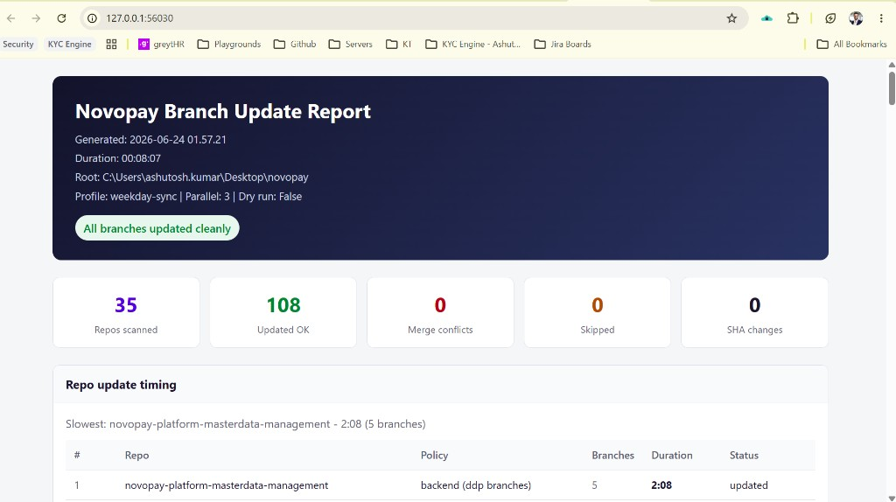

# Novopay Branch Updater

Windows tool that keeps your local Novopay git branches in sync with `origin` across every repo under your `novopay` folder. One double-click, one HTML report, no log files.

**Repo:** https://github.com/trusttAshutosh/novopay-branch-updater

---

## Who is this for?

Anyone on the Novopay team who works across multiple repos (`ddp-*` backend branches, `dsa-*` frontend branches) and wants a single command to fetch and update them all without manually `git pull` in each folder.

---

## Requirements

| Requirement | Notes |
|-------------|-------|
| **Windows** | PowerShell 5.1+ (built into Windows 10/11) |
| **Git** | On `PATH`; SSH or HTTPS remotes already configured |
| **Network** | VPN / corporate network if your `origin` needs it |
| **Novopay folder** | All service repos cloned as siblings under one root |

No admin rights needed for normal runs.

---

## Quick start (first time)

1. Place or clone this tool at `novopay/tools/novopay-branch-updater/` (or anywhere - see [Where does the tool live?](#where-does-the-tool-live)).
2. If your novopay root is **not** two levels above this folder, copy `config.local.json.example` to `config.local.json` and set `novopayRoot`.
3. **Close IntelliJ / WebStorm** (strongly recommended - see [Why close the IDE?](#why-close-the-ide)).
4. Double-click **`run.cmd`**.
5. Wait for `DONE` and the browser report. Review it, then **close the browser tab** (deletes the report file).
6. Reopen your IDE.

Optional: double-click **`register-schedule.cmd`** once for weekday 9 AM / 9 PM idle-only runs.

---

## `run.cmd` vs `run-dry.cmd`

| | **`run.cmd`** | **`run-dry.cmd`** |
|---|---------------|-------------------|
| **Purpose** | Real sync | Preview only |
| **Git fetch** | Yes | No |
| **Checkout / merge** | Yes | No |
| **Stash / restore** | Yes, if you have local changes | No |
| **Browser report** | Opens automatically | Not opened; file written to `.reports/` |
| **When to use** | Normal daily sync | Before a big sync, or after editing `config.json` |

Both accept extra flags, e.g. `run.cmd -Profile pre-release-sync` or `run-dry.cmd -MaxParallel 1`.

---

## What happens on a real run (`run.cmd`)

For each git repo under your novopay root (except excluded repos):

1. **Pre-flight** - disk space, git lock files, merge/rebase in progress, `origin` reachable.
2. **Stash** - uncommitted changes are stashed (if any).
3. **Fetch** - `git fetch --all --prune`.
4. **Per branch** - checkout branch, fetch if needed, then:
   - Skip if local is **ahead** of `origin` (unpushed commits - protects your work).
   - **Fast-forward** if possible (`git merge --ff-only`).
   - **Merge** if local and remote diverged (when enabled in config).
   - **Abort** on conflict; continue with next branch.
5. **Restore** - checkout your original branch; `stash pop` if we stashed.
6. **Report** - summary opens in browser.

Repos run **3 at a time** by default (configurable). Nothing is ever **pushed** to remote.

---

## Which repos and branches are updated?

### Repos scanned

Every folder under `novopayRoot` that contains a `.git` directory, plus the root itself if it is a git repo.

### Repos excluded (never touched)

Listed in `excludedRepos`. **`bob-the-builder` is excluded by default.**

### Branch policy per repo

| Repo type | How identified | Branches updated |
|-----------|----------------|------------------|
| **Frontend** | Folder name in `frontend.repos` | `dsa-qa`, `dsa-prod`, `dsa-uat`, `dsa-bkup-qa`, `dsa-bkup-uat` |
| **Backend** | Everything else (default) | `ddp-uat`, `ddp-bkup-uat`, `ddp-fea-prod-stable`, `ddp-qa`, `ddp-bkup-qa` |
| **All local branches** | Folder name in `allLocalBranchesRepos` | Every branch that exists locally (e.g. `trustt-platform-ddp-manual-report-queries`) |

### Process order

Repos in `preferredRepoOrder` run first (lib, creditcard, masterdata, gateway, actor, and so on). All others run alphabetically after.

### Profiles

Override branch lists without editing the main config:

```cmd
run.cmd -Profile pre-release-sync
```

`pre-release-sync` updates only `ddp-fea-prod-stable`, `ddp-qa`, and `ddp-uat` on backend repos.

---

## Understanding the HTML report



| Metric | Meaning |
|--------|---------|
| **Repos scanned** | Repos actually processed (excludes `excludedRepos`) |
| **Updated OK** | Branches merged or already up to date |
| **Merge conflicts** | Branches where merge was aborted |
| **Skipped** | e.g. local ahead of origin, checkout failed |
| **SHA changes** | Branches whose commit moved |
| **Repo update timing** | Per-repo duration; slowest highlighted |

The report is served at `127.0.0.1` so the tool can delete the file when you close the tab. **No data leaves your machine.**

Static preview: [`docs/sample-report.html`](docs/sample-report.html)

Use `-KeepReport` or `report.keepReport: true` to keep the HTML/JSON after the run.

---

## CLI reference

```cmd
run.cmd                          REM normal run (3 parallel repos)
run-dry.cmd                      REM dry-run - no git changes
run.cmd -Profile pre-release-sync
run.cmd -MaxParallel 1           REM serial (slow network / debugging)
run.cmd -KeepReport              REM keep report files after run
```

PowerShell flags: `-DryRun`, `-Profile`, `-MaxParallel`, `-KeepReport`

---

## Configuration

Edit **`config.json`** (team defaults, committed) or **`config.local.json`** (your machine only, gitignored).

| Setting | Purpose |
|---------|---------|
| `novopayRoot` | Path to novopay folder. Empty = auto-detect (`../..` from this tool) |
| `novopayRootEnv` | Env var override (default `NOVOPAY_ROOT`) |
| `frontend.repos` / `frontend.branches` | Webapp repos and their `dsa-*` branches |
| `backend.branches` | Default `ddp-*` branches for all other repos |
| `allLocalBranchesRepos` | Repos where every local branch is synced |
| `excludedRepos` | Folder names skipped entirely (`bob-the-builder` by default) |
| `preferredRepoOrder` | Priority processing order |
| `defaultProfile` / `profiles` | Named branch overrides |
| `execution.maxParallelRepos` | Parallel repo count (default `3`) |
| `execution.preferFastForward` | Try ff-only before merge (default `true`) |
| `execution.skipIfLocalAhead` | Skip branches with unpushed commits (default `true`) |
| `execution.preflightChecks` | Disk / lock / origin checks (default `true`) |
| `report.writeJson` | Write `.json` alongside HTML (default `true`) |
| `report.keepReport` | Keep files instead of delete-on-tab-close (default `false`) |
| `report.notifyOnFailure` | Windows popup on conflicts / stash failures (default `true`) |
| `scheduler.idleMinutes` | Idle time before scheduled run (default `5`) |
| `scheduler.weekdayTimes` | Times for Task Scheduler (default `09:00`, `21:00`) |

**Team workflow:** commit `config.json` with shared defaults. Each developer only needs `config.local.json` when their novopay path differs.

---

## IntelliJ / WebStorm

**Option A - Import external tool**

1. Open the **novopay root** project (or `novopay.code-workspace`).
2. Copy `intellij/externalTools.xml` to `.idea/externalTools.xml`.
3. Restart the IDE.
4. **Settings - Tools - External Tools - Novopay Branch Updater** - assign a shortcut (e.g. `Ctrl+Alt+U`).

**Option B - Manual external tool**

| Field | Value |
|-------|-------|
| Program | `cmd.exe` |
| Arguments | `/c "$ProjectFileDir$\tools\novopay-branch-updater\run.cmd"` |
| Working directory | `$ProjectFileDir$` |

If you open only a single service repo, set `NOVOPAY_ROOT` or `config.local.json`.

Close the IDE before running; reopen after you close the report tab.

---

## Scheduled runs

`register-schedule.cmd` creates two Windows Task Scheduler jobs:

- **Weekdays only** (Mon-Fri) at **9:00 AM** and **9:00 PM**
- Runs only after **5 minutes idle** (no keyboard/mouse)
- Waits up to **2 hours** for idle if you were active at trigger time
- Laptop must be **on** and you must be **logged in**

Remove scheduled tasks:

```powershell
Unregister-ScheduledTask -TaskName 'Novopay Branch Updater 9AM' -Confirm:$false
Unregister-ScheduledTask -TaskName 'Novopay Branch Updater 9PM' -Confirm:$false
```

---

## FAQ

### Where does the tool live?

Anywhere. Common layout:

```
Desktop/novopay/                              # all git repos here
Desktop/novopay/tools/novopay-branch-updater/ # this tool
```

Or clone standalone and point `novopayRoot` / `NOVOPAY_ROOT` at your repo folder.

### Does it push to remote?

**No.** Fetch and merge from `origin` only. Your unpushed commits stay local.

### What happens to my uncommitted changes?

Stashed before the repo is touched, then restored on your **original branch** after that repo finishes. If `stash pop` fails, the stash is kept and listed under **Stash restore failures** in the report.

### What happens on merge conflict?

`git merge --abort` for that branch. The repo continues with the next branch. Conflicts appear in the report. Your original branch is restored at the end of each repo.

### Why is a branch marked `not-found`?

The branch does not exist locally **and** `origin/<branch>` does not exist after fetch. Common for repos that never had that branch cloned. Not an error - informational only.

### Why is a branch skipped (local ahead)?

`skipIfLocalAhead` is on by default. If you have unpushed commits on that branch, the tool skips it so a merge does not overwrite or complicate your work. Push or rebase manually, then re-run.

### Why close the IDE?

The tool checks out many branches across 30+ repos. IntelliJ indexes git roots and watches files in the background. Closing the IDE avoids lock contention and a second full re-index mid-run. Reopen after the sync for one clean index pass.

### How long does a full run take?

Typically **5-15 minutes** for 30+ repos, depending on network and parallel setting. `maxParallelRepos: 3` is roughly 2-3x faster than serial. Per-repo timing is in the report; lib and masterdata are often slowest.

### Can I exclude a repo?

Add its **folder name** (not full path) to `excludedRepos` in `config.json` or `config.local.json`.

### Can I add or remove branches?

Edit `backend.branches`, `frontend.branches`, or a profile in `config.json`. Run `run-dry.cmd` first to preview.

### What is dry-run useful for?

See which branches would fast-forward, merge, skip, or are missing - **without** changing git state. Faster and safe after config changes.

### Why does the report use `127.0.0.1`?

Browsers cannot delete a file opened as `file://`. A tiny local server serves the HTML, detects tab close, then deletes the file.

### Scheduled run did nothing - why?

You were not idle for 5+ minutes, it was a weekend, the laptop was off/asleep, or you were still active at 9 PM (scheduler waits up to 2 hours for idle).

### Does it need admin rights?

No for normal use. Task Scheduler registration runs as your user. Rare: if the report server fails on a locked-down PC, run once as admin or add a URL ACL for the localhost port.

### PowerShell execution policy blocked the script?

The `.cmd` launchers pass `-ExecutionPolicy Bypass`. If you run the `.ps1` directly, use the same flag or set execution policy for your user.

### What about empty repos (no commits)?

Repos with `.git` but no commits on `HEAD` (e.g. fresh clones) are skipped with a clear message. No branches are updated there.

### Are log files written?

**No.** Only a transient HTML report (and optional JSON in `.reports/`). Use `-KeepReport` to retain them.

### What if I see `ERR_CONNECTION_REFUSED` on the report URL?

Update to the latest version - an older build had a race starting the local report server. The current `Open-Novopay-Report.ps1` fixes this.

### What does exit code 2 mean?

At least one merge conflict or stash restore failure occurred. Details are in the report (and a Windows popup if enabled).

---

## Files

```
novopay-branch-updater/
  run.cmd                       Normal sync
  run-dry.cmd                   Dry-run preview
  register-schedule.cmd         Task Scheduler setup
  config.json                   Team defaults
  config.local.json             Your overrides (gitignored)
  scripts/
    Update-Novopay-Branches.ps1 Orchestrator
    Process-Single-Repo.ps1     Per-repo worker
    Git-Helpers.ps1             ff-only, preflight, SHA helpers
    Report-Builder.ps1          HTML + JSON report
  intellij/externalTools.xml    IDE template
  docs/images/html-report.png   README screenshot
  docs/sample-report.html       Static report preview
  .reports/                     Transient output (gitignored)
```

---

## Share with the team

1. Clone or copy this repo into `novopay/tools/novopay-branch-updater/`.
2. Commit `config.json` with team branch lists and exclusions.
3. Each developer copies `config.local.json.example` to `config.local.json` only if their novopay path differs.
4. Optional: import the IntelliJ external tool and register the schedule.
